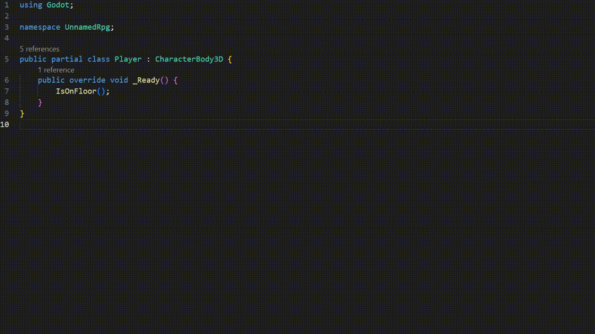

# Godot Docs for C#

Hover on Godot keywords to show link to online documentation. 

## Features

- Supports links to classes, properties, methods, signals, constants and enums
- Redirects to documentations of the corresponding Godot version

## Requirements

- [C# Extension for Visual Studio Code](https://marketplace.visualstudio.com/items?itemName=ms-dotnettools.csharp)
- Projects created with [Godot Engine (.NET version)](https://godotengine.org/)

## Installation

- VS Code (recommend)
- Github releases
